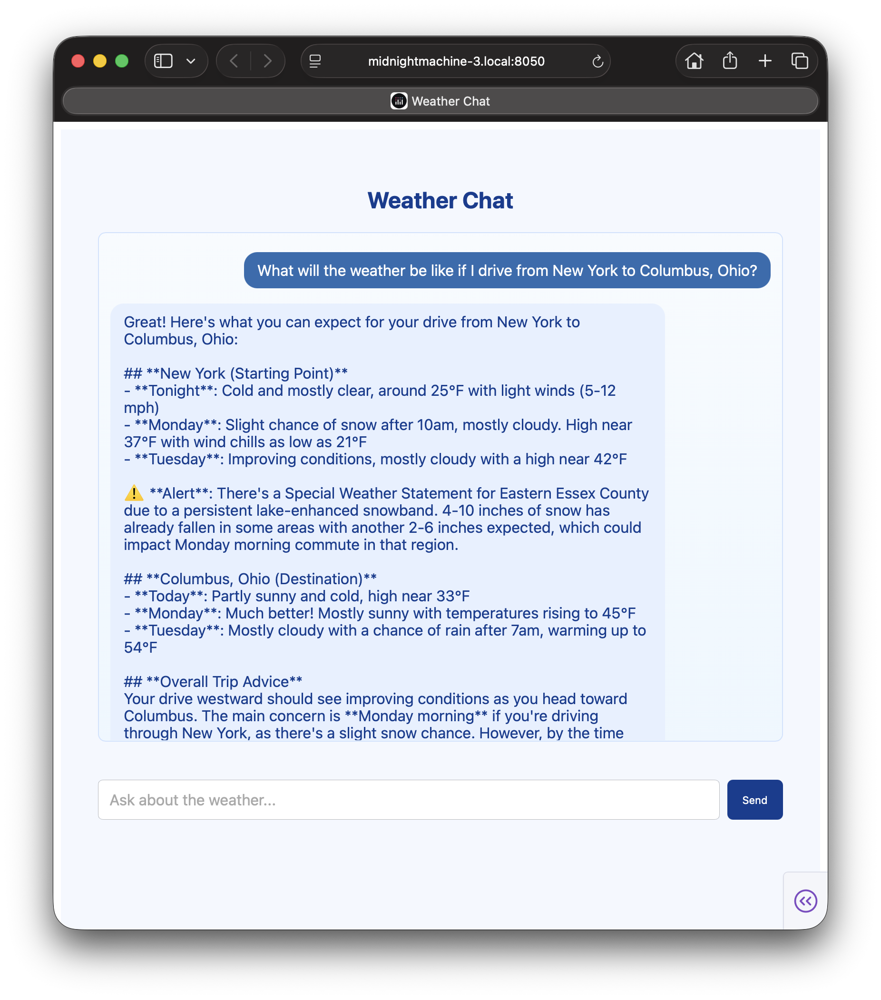

# Weather Agent (MCP Demo)



---
🌤️ **Overview**

This repository is a concise, technical demonstration of an agent that uses the Model Context Protocol (MCP) to access live weather data. It provides:

- A small MCP-compliant server (implemented with FastMCP) that exports tools for geocoding, fetching forecasts, and fetching active weather alerts from the U.S. National Weather Service (NWS).
- A minimal MCP JSON-RPC stdio client for invoking server tools from a local agent process.
- An agent wrapper that uses an LLM (Anthropic client) with tool access via MCP to answer natural-language weather queries.
- A minimal Dash-based single-page chat UI to interact with the agent.

This project is intended as an educational, reference-quality example of integrating an LLM agent with live data sources using MCP; it is not intended for production use as-is.

---

## Project structure

- `agent_code.py` — The interactive CLI agent and the main agent logic; starts the MCP server and uses `Anthropic` to plan tool uses.
- `app.py` — Minimal Dash web UI that runs the agent and exposes a single-page chat UI.
- `weather/server.py` — MCP server module; declares tool metadata via `@tool(...)` decorators and exposes `run_server()`.
- `weather/client.py` — `MCPStdIOClient` implementing a JSON-RPC 2.0 client over stdio for communicating with the MCP server process.
- `config.py` — Agent system prompt and programmatic `TOOLS` export (pulls tool specs from the server module).
- `requirements.txt` — Python dependencies (e.g., `anthropic`, `httpx`, `mcp`).
- `keys.txt` — Convenience file included in the repo (inspect and remove sensitive entries if present).
- `logs/` — Default directory for logs generated by the agent, MCP client, and server.
- `tests/` — Placeholder for unit/integration tests (empty in this demo).

---

## Design & architecture (technical)

1. MCP Server (Weather tools)
   - Implemented in `weather.server` and uses `mcp.server.fastmcp.FastMCP` to expose tools.
   - Tools are declared using a lightweight `@tool(schema=...)` decorator. Each tool includes a JSON Schema-style input description and a textual description.
   - Provided tools:
     - `geocode(location: str)` — Uses Google Geocoding API (requires API key) to convert freeform location to latitude/longitude.
     - `get_forecast(latitude: float, longitude: float)` — Uses NWS endpoints to fetch a short forecast for the provided coordinates.
     - `get_alerts(state: str)` — Fetches active alerts for a two-letter US state code via NWS alerts API.
   - The server can be run directly with `python -m weather.server` (stdio transport is the default for the demo) or programmatically via `run_server()`.

2. MCP Client (stdio JSON-RPC)
   - Implemented in `weather.client.MCPStdIOClient`.
   - Starts the MCP server process (module invocation) and exchanges newline-delimited JSON messages over stdio.
   - Supports `initialize` handshake, `tools/call` requests, notifications, and handles basic timeouts and logging.
   - Returns tool results in a high-level format (extracts `content` text when present).

3. Agent
   - Implemented in `agent_code.WeatherAgent`.
   - Uses Anthropic client (`anthropic.Anthropic()`) as the LLM provider to generate the agentic reasoning and tool-use intentions.
   - The agent runs a simple loop: send messages + tools metadata to the model, process tool_use blocks (forwarded to the MCP server via the stdio client), and incorporate tool results into the conversation.
   - The agent also includes CLI (`main()`) to interact in a terminal and a convenience integration in `app.py` for the Dash UI.

---

## Requirements & Setup

Prerequisites
- Python 3.10+ (the code uses modern typing syntax and assumes recent Python features).
- A working virtual environment (recommended).

Install dependencies:

```bash
python -m venv .venv
source .venv/bin/activate
pip install -r requirements.txt
```

Environment variables
- `ANTHROPIC_API_KEY` (recommended): Required to use the Anthropic Python client. If unset, the agent will not be able to call the LLM.
- `GOOGLE_GEOCODING_API_KEY` (optional): Required for `geocode()` to convert named locations to coordinates. If unset, `geocode()` returns a helpful error message.
- `LOG_DIR` (optional): Directory for agent/server logs (defaults to `logs/`).

Security note: Do not commit secrets. Delete or rotate keys in `keys.txt` or `.env` files if they contain credentials.

---

## Running the demo

1. CLI agent (single-machine, starts MCP server automatically):

```bash
python agent_code.py
```

The agent will start the MCP server (using `sys.executable -m weather.server`), create a small conversation loop, and allow interactive queries. Use `exit` / `quit` to stop.

2. Dash web UI (single-page app):

```bash
python app.py
# open http://127.0.0.1:8050
```

The Dash app starts the same `WeatherAgent` in a background thread and serves a minimal chat interface.

3. Running the MCP server directly (for debugging):

```bash
python -m weather.server
```

You can then invoke tools using the provided `MCPStdIOClient` or by implementing your own MCP client.

---

## Operational notes

- The MCP transport is stdio (newline-delimited JSON). The `MCPStdIOClient` expects the server to write JSON objects line-by-line to stdout and to accept JSON messages on stdin.
- The NWS API does not require authentication for basic public endpoints used in the demo. The server respects a `User-Agent` header and follows API guidelines.
- Google Geocoding requires an API key; set `GOOGLE_GEOCODING_API_KEY` to enable geocoding.
- Logs are written to `logs/` by default. Look at `logs/ai_responses.log`, `logs/mcp_server.log`, `logs/weather_server.log`, and `logs/agent_tools.log` for debugging information.

---

## Limitations & cautions

- This demonstration intentionally omits robust production features: input validation, rate limiting, retries for API throttling, robust error handling, observability hooks, and secure secret management.
- The agent code assumes a trustworthy local environment. Do not expose the demo as-is to untrusted users or networks without adding authentication, request rate limiting, and security review.

---

## Contributing

Contributions are welcome (issues/PRs). Consider:
- Adding tests (unit and integration)
- Improving error handling
- Adding more comprehensive tooling for testing MCP interactions

---

## License & contact

Use and modification are at your discretion — add a license of your choice if you plan to publish or reuse this code.

If you have questions or need help understanding the code, open an issue describing your use case or desired feature.

---

🔧 Quick reference commands

- Run agent (CLI): `python agent_code.py`
- Run server only: `python -m weather.server`
- Run web UI: `python app.py`
- Install deps: `pip install -r requirements.txt`

